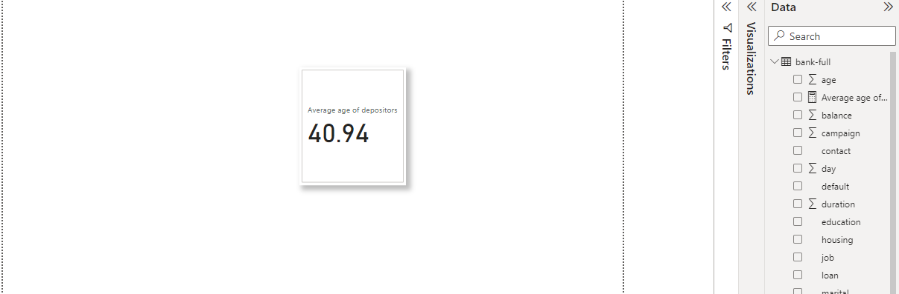
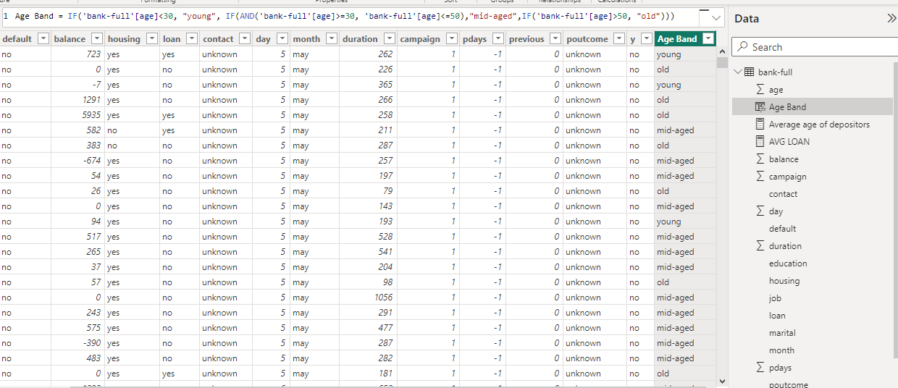
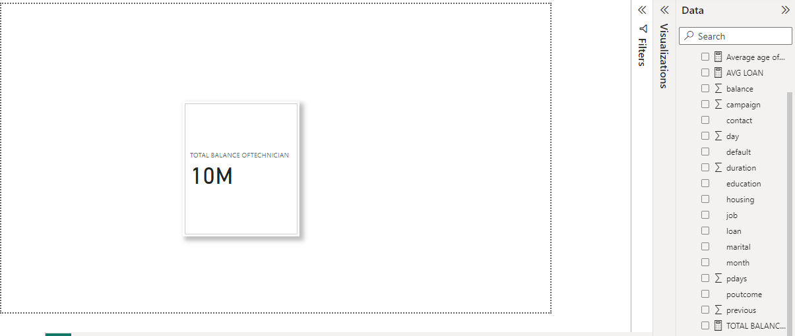
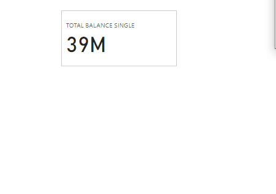

# TASK4POWERBI

## USING BANK TERM DEPOSIT
### CREATE A MEASURE FOR THE AVERAGE AGE OF THE DEPOSITORS

### CREATE A NEW COLUMN AGE BAND CONTAINING AGED,MID AGE AND OLD

### CREATE A MEASURE CALCULATING TOTAL BALANCE FOR JOB:TECHNICHIAN

### CREATE A MEASURE CALCULATING SINGLES

### CREATE A MEASURE CALCULATING MARRIED

